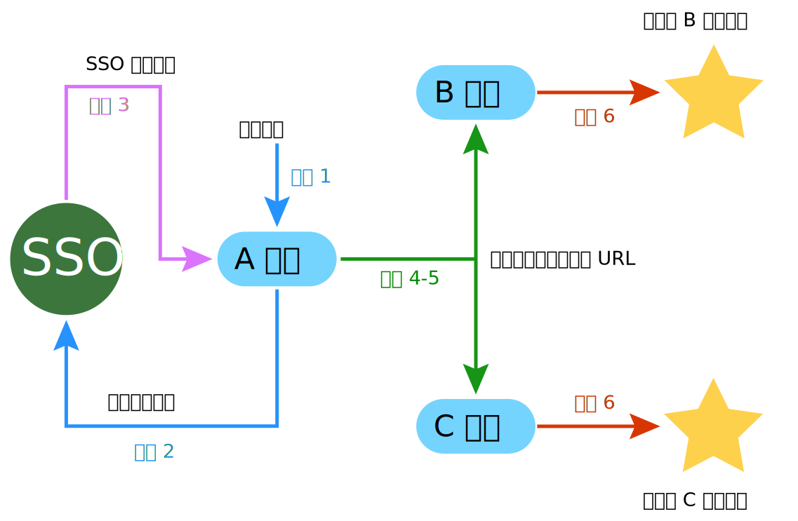

## 同步登录接口

本接口使得用户在一点登录以后，在所有网站同时登录或者登出，要全面实现这一功能，需要此接口与“同步登录通知”配合才能实现，关于同步登录通知请查看 [通知 -> 同步登录通知](../notify/sync.md)。

同步登录接口流程：

1. 用户登录应用；
2. 当前应用调用本接口；
3. 当前应用通过本接口得到所有开启同步登录的应用的“同步登录通知 URL”；
4. 将得到的这些 URL 发送到客户端浏览器；
5. 由浏览器访问这些 URL；
6. 这些 URL 在接收到请求以后，做出一系列的验证，保证参数是合法的，然后将用户状态设置为已登录。

下图是同步流程示意图，本文档描述下图中蓝线和紫线部分，即流程 1-3，流程 4-6 请查看 [通知 -> 同步登录通知](../notify/sync.md)：

{.img-fluid .bg-img}

----------

### 同步登录

本接口使得用户在一点登录以后，在所有网站同时登录。

##### URL

http://server/index.php/api/sync/login

##### HTTP 请求方式

POST

##### 加密参数

参数进行 JSON 编码，然后将 JSON 字符串进行加密。然后把加密的结果作为 `公共请求参数` 的 code 参数。

| 名称 | 类型 | 必需 | 描述 |
| - | - | - | - |
| user_id | int | true | 优先级为 user_id &gt; user_name &gt; user_mail，三选一。 |
| user_name | string | | |
| user_mail | string | | 是否允许邮箱登录，视注册设置情况而定。 |
| user_access_token | string | true | 访问口令，必须用 MD5 加密后传输。 |
| timestamp | int | true | UNIX 时间戳 |

##### 返回结果是否加密

否

| 键名 | 类型 | 描述 | 备注 |
| - | - | - | - |
| rcode | string | 返回代码 | |
| urlRows | array | 同步登录通知 URL | 系统会在“同步登录通知 URL”上附加 `m=sso&c=sync&a=login` 参数，以便接收通知的系统识别。 |
 
返回结果示例

``` javascript
{
    "rcode": "y100401",
    "urlRows": [ //通知 URL
        "http://abc.com/api/api.php?m=sso&c=sync&a=login&sign=SDFDSFSDREWERWUGROE7TREIE&code=CSMEIFh7AHYBOFIlXQwAaQE0UXENawF2WUxXUbg1zASk%3D&key=tLUwyt",
        "http://123.cn/api/api.php?m=sso&c=sync&a=login&&sign=SDFDSFSDREWERWUGROE7TREIE&code=CSMEIFh7AHYBOFIlXQwAaQE0UXENawF2WUxXUbg1zASk%3D&key=tLUwyt"
    ]
}
```
 
----------

### 同步登出

本接口使得用户在一点登出以后，在所有网站同时登出。

##### URL

http://server/index.php/api/sync/logout

##### HTTP 请求方式

POST

##### 加密参数

参数进行 JSON 编码，然后将 JSON 字符串进行加密。然后把加密的结果作为 `公共请求参数` 的 code 参数。

| 名称 | 类型 | 必需 | 描述 |
| - | - | - | - |
| user_id | int | true | 优先级为 user_id &gt; user_name &gt; user_mail，三选一。 |
| user_name | string | | |
| user_mail | string | | 是否允许邮箱登录，视注册设置情况而定。 |
| user_access_token | string | true | 访问口令，必须用 MD5 加密后传输。 |
| timestamp | int | true | UNIX 时间戳 |

##### 返回结果是否加密

否

| 键名 | 类型 | 描述 | 备注 |
| - | - | - | - |
| rcode | string | 返回代码 | |
| urlRows | array | 同步登录通知 URL | 系统会在“同步登录通知 URL”上附加 `m=sso&c=sync&a=logout` 参数，以便接收通知的系统识别。 |

----------

### 调用 URL 示例

取得结果以后，开发者应该向浏览器输出调用“同步登录通知 URL”的 HTML，“同步登录通知 URL”在接收到通知以后做进一步处理。

##### AJAX + JSONP 方式

由于 AJAX 方式提交数据会涉及到跨域问题，因此 dataType 设置为 JSONP。关于 JSONP 请查看 [互动百科]((http://www.baike.com/wiki/jsonp)。AJAX 方式的优点是可以获知调用的状态，以便于判断同步是否成功，缺点是存在跨域问题，在部分浏览器可能存在兼容性问题，开发者也可尝试使用 SCRIPT 等其他方式。

``` php
<script type="text/javascript">
$(document).ready(function(){
    <?php foreach ($sync['urlRows'] as $key=>$value) { ?>
        $.ajax({
            url: '<?php echo $value; ?>', //url
            type: 'get', //方法
            dataType: 'jsonp', //数据格式为 jsonp 支持跨域提交
            async: false, //设置为同步
            complete: function(){ //读取返回结果
                <?php if (end($sync['urlRows']) == $value) { ?> //如果是最后一个 URL，访问完毕后跳转
                    window.location.href = 'http://www.abc.com'; //跳转
                <?php } ?>
            }
        });
    <?php } ?>
});
</script>
```
 
##### SCRIPT 方式

开发者也可以根据实际情况选择 SCRIPT 方式或者 IFRAME 方式，这两种方式的优点是无跨域问题，缺点是无法获知调用的状态，无法判断同步是否成功。

``` php
<?php foreach ($sync['urlRows'] as $key=>$value) { ?>
    <script type="text/javascript" src="<?php echo $value; ?>"></script>
<?php } ?>
```