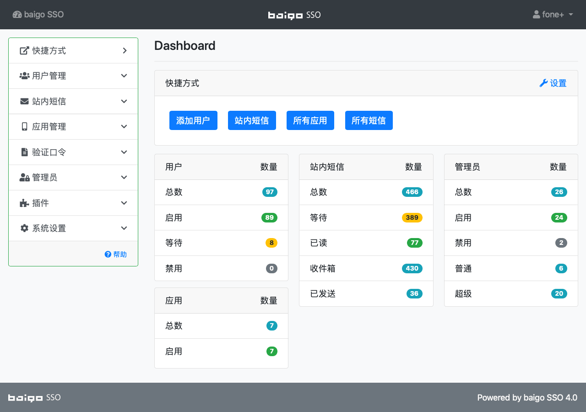

## 后台概述

baigo SSO 的管理后台地址为 http://server/index.php/console，在登录界面输入用户名、密码、验证码登录。进入后台后的界面如下：

{.img-fluid .bg-img}

----------

##### 功能模块说明

可以通过左侧菜单进入响应管理模块，右上角的用户菜单可以进行修改密码、修改个人信息等操作。

| 菜单 | 描述 |
| - | - |
| 快捷方式 | 管理员可以自定义快捷方式，通过 Dashboard 中的 `设置` 链接进入设置功能 |
| 用户管理 | 已注册的用户管理，您可以在此对用户进行各种管理操作 |
| 站内短信 | 站内短信 |
| 应用管理 | 要整合 baigo SSO，必须在此创建应用，对应用授予相应的权限，这些应用通过 API 接口调用来实现各种功能。 |
| 验证口令 | 用户在进行一些操作时，比如：注册、更换邮箱、忘记密码等，系统会生成验证口令，并通过邮件的形式发送给用户，此处可以管理验证口令。 |
| 管理员 | 管理员管理 |
| 插件 | 插件的安装、管理、设置 |
| 系统设置 | 您可以在此设置网站名称、时区、各类格式等 |