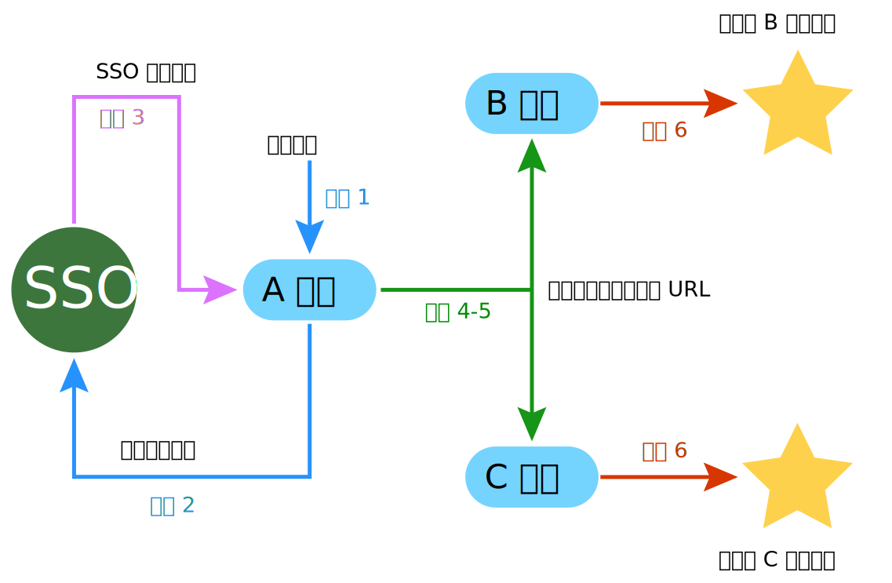

## 同步登录通知

用户在一点登录以后，在所有网站同时登录或者登出，要全面实现这一功能，需要与“同步登录接口”配合才能实现，关于同步登录接口请查看 [API 接口 -> 同步登录接口](../api/sync.md)。

同步登录接口流程：

1. 用户登录应用；
2. 当前应用调用本接口；
3. 当前应用通过本接口得到所有开启同步登录的应用的“同步登录通知 URL”；
4. 将得到的这些 URL 发送到客户端浏览器；
5. 由浏览器访问这些 URL；
6. 这些 URL 在接收到请求以后，做出一系列的验证，保证参数是合法的，然后将用户状态设置为已登录。

下图是同步流程示意图，本文档描述下图中绿线和红线部分，即流程 4-6，流程 1-3 请查看 [API 接口 -> 同步登录接口](../api/sync.md)：

{.img-fluid .bg-img}

### 公共通知参数

公共通知参数是指向所有通知发起时都传递的参数。

| 参数名 | 类型 | 描述 | 备注 |
| - | - | - | - | - |
| code | string | 加密参数 | 需要将该参数进行解密，解密时，要把 App Key 作为 key 参数，App Secret 作为 iv 参数。 |
| sign | string | 签名 | 将通知参数中的加密参数解密，得到一个 JSON 对象，直接将此对象进行签名验证，验证签名时，要把 App Key 和 App Secret 连接作为盐。 |

----------

### 同步登录

本接口使得用户在一点登录以后，在所有网站同时登录。

##### HTTP 请求方式

GET

##### URL 附加参数

m=sso&c=sync&a=login

##### 加密参数

| 键名 | 类型 | 描述 | 备注 |
| - | - | - | - |
| user_id | int | 用户 ID | |
| user_name | string | 用户名 | |
| user_mail | string | 邮箱 | |
| app_id | int | 应用的 App ID | 后台创建应用时生成。 |
| app_key | string | 应用的 App Key | 后台创建应用时生成。 |
| timestamp | int | UNIX 时间戳 | |

解密结果示例

``` javascript
{
    "user_id": "1",
    "user_name": "baigo",
    "user_mail": "baigo@baigo.net",
    "app_id": "1",
    "app_key": "sfewrw8084382h2r9fdsw9ey5whfDISORwegds",
    "timestamp": "1550198497"
}
```
 
----------

### 同步登出

本接口使得用户在一点登出以后，在所有网站同时登出。

##### HTTP 请求方式

GET

##### URL 附加参数

m=sso&c=sync&a=logout

##### 加密参数

| 键名 | 类型 | 描述 | 备注 |
| - | - | - | - |
| user_id | int | 用户 ID | |
| user_name | string | 用户名 | |
| user_mail | string | 邮箱 | |
| app_id | int | 应用的 App ID | 后台创建应用时生成。 |
| app_key | string | 应用的 App Key | 后台创建应用时生成。 |
| timestamp | int | UNIX 时间戳 | |

解密结果示例

``` javascript
{
    "user_id": "1",
    "user_name": "baigo",
    "user_mail": "baigo@baigo.net",
    "app_id": "1",
    "app_key": "sfewrw8084382h2r9fdsw9ey5whfDISORwegds",
    "timestamp": "1550198497"
}
```
